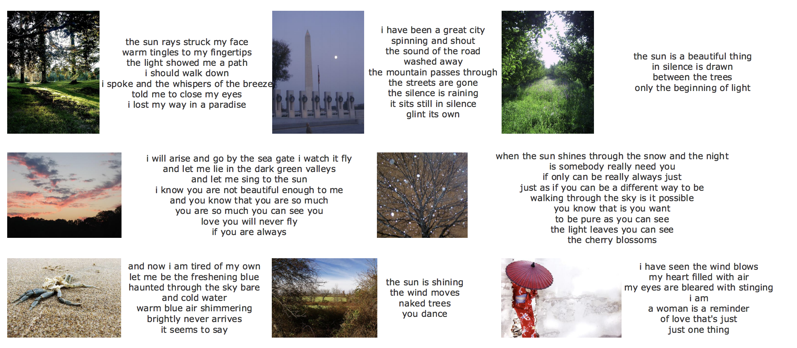
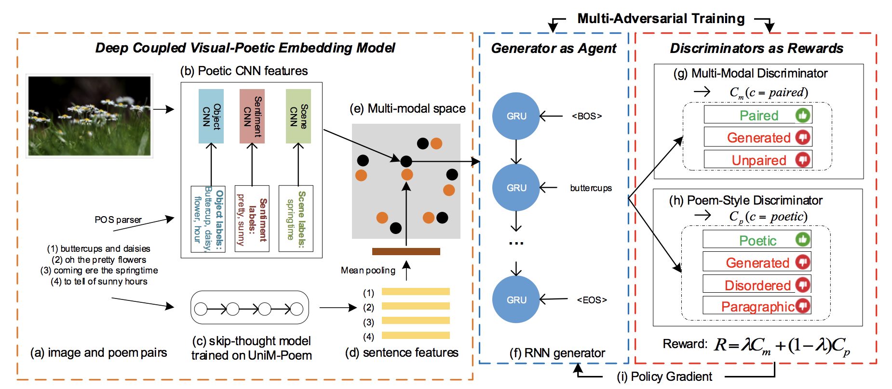

# Beyond Narrative Description: Generating Poetry from Images by Multi-Adversarial Training
An implementation of the image-to-poem model described in the paper:
"Beyond Narrative Description: Generating Poetry from Images by Multi-Adversarial Training."

Bei Liu, Jianlong Fu, Makoto P. Kato, Masatoshi Yoshikawa

Full text available at: https://arxiv.org/abs/1804.08473

## Contents
* [Model Overview](#model-overview)
    * [Introduction](#introduction)
    * [Architecture](#architecture)
* [Getting Started)(#getting-started)
    * [Install Required Packages](#install-required-packages)
    * [Prepare the Training Data](#prepare-the-training-data)
    * [Download Trained Model](#download-trained-model)
* [Training a Model](#training-a-model)
* [Generating Poems](#generating-poems)
* [Web Demo](#web-demo)

## Model Overview

### Introduction

The Img2poem model is a deep neural network that learns how to generate poems from images. For example:


### Architecture


## Getting Started

### Install Required Packages
(It is recommended to install the dependencies under Conda environment.)  
* python2.7  
* tensorflow1.6  
* mxnet  
* opencv  
* scikit-image  
* tqdm  
* colorama  
* flask

### Prepare the Training Data
Both datasets are formatted in JSON files.

MultiM-Poem.json: image and poem pairs

```json
[
	{
		"poem": str,
		"image_url": str,
		"id": int
	},
	...
]
```

UniM-Poem.json: poem corpus

```json
[
	{
		"poem": str,
		"id": int
	},
	...
]
```

### Download Trained Model
Please download models from https://1drv.ms/u/s!AkLgJBAHL_VFgSyyfpeGyGFZux56 and put it under "code/".

## Training a Model
You can start train a new model using following training script:
```bash
python train.py 
```

## Generating Poems
The following command line will generate poem for an image.
```bash
python test.py --input-file input.jpg
```
Example output:
```txt
AAAAA
BBBBB
CCCC
```
Note: you may get different results. Some variation between different models is expected.

## Web Demo
We also prepare a web demo, which is more user friendly. To run such demo, please run
```bash
python server.py
```
under "code/src/" folder. Then you can open http://127.0.0.1:5000 to access the it.
